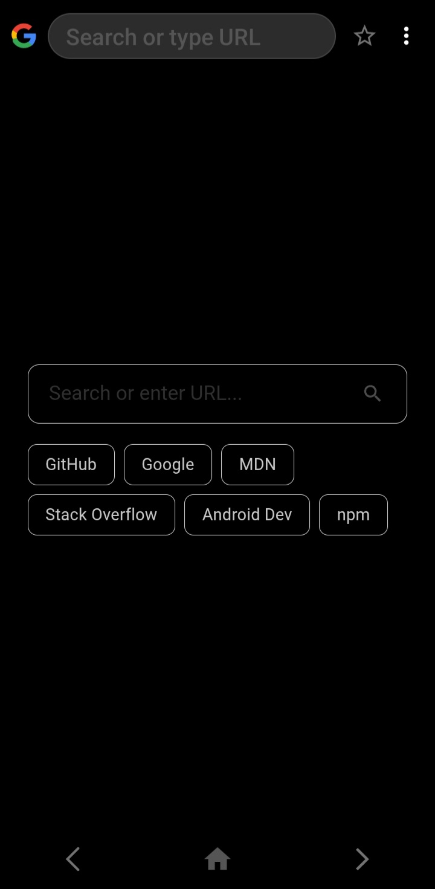
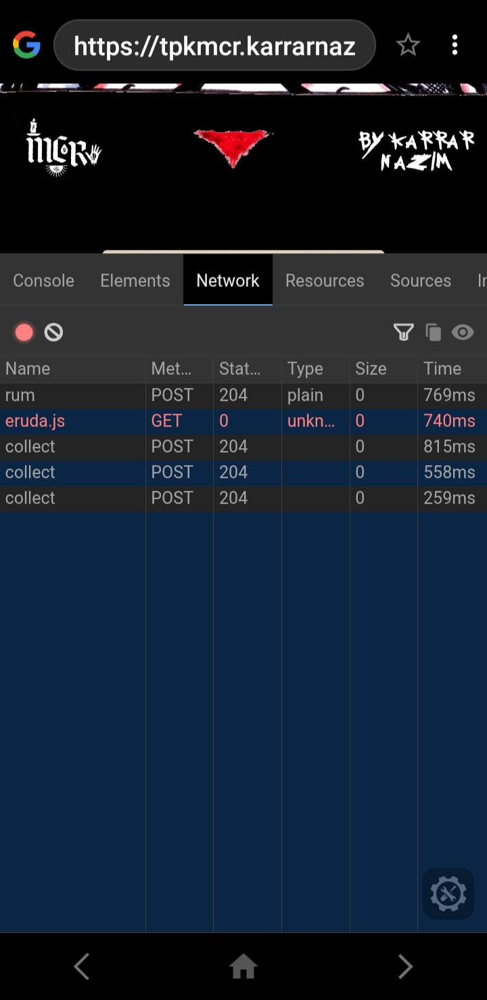
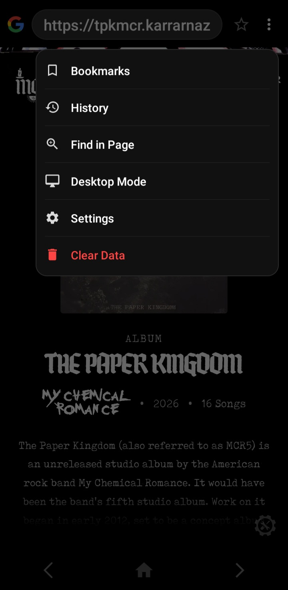

 
 
 
**A lIghtweight, developer-focused Android web browser that brings desktop-like debugging to mobile.**

 

  
  &nbsp;&nbsp;&nbsp;&nbsp;
  
  &nbsp;&nbsp;&nbsp;&nbsp;
  

## About The Project

**ConsoleFlow** is not just another web browser. It is built specifically for web developers who need to debug websites on mobile devices. By intercepting web requests using `OkHttp`, ConsoleFlow automatically injects [Eruda](https://github.com/liriliri/eruda) (a mobile web console) into web pages, allowing you to view console logs, inspect DOM elements, check network requests, and execute JavaScript right from your Android phone.

## Features

- **Auto-Injected Web Console:** Automatically injects Eruda into web pages for seamless mobile debugging.
- **Smart Interception (Anti-CAPTCHA):** Bypasses interception for major search engines (Google, Bing, DuckDuckGo) to prevent annoying CAPTCHAs.
- **Desktop Mode:** One-tap switch to a real desktop user agent and viewport.
- **Custom JS Injection:** Add your own custom JavaScript to be executed automatically on every page load.
- **Find in Page:** Easily search for specific text within any webpage.
- **Bookmarks & History:** Built-in local storage manager for your favorite sites and browsing history.
- **Native Downloads:** Integrated with Android's native `DownloadManager` for stable file downloading.
- **Sleek UI:** Custom dark-themed start page, error pages, menus, and Android 12+ Splash Screen support.

## Tech Stack & Libraries

- **Language:** Kotlin
- **Network Interception:** OkHttp3
- **Web Rendering:** android.webkit.WebView
- **UI Components:** AndroidX, Material Design Components, SwipeRefreshLayout
- **Dev Tools:** Eruda (Local Asset)

## Installation

ConsoleFlow is ready to use right out of the box. 

### System Requirements
- **OS:** Android 5.0 (Lollipop, API 21) or higher.
- **Architecture:** Universal. The application is built entirely on Android framework APIs and Java/Kotlin bytecode, meaning it supports all device architectures (armeabi-v7a, arm64-v8a, x86, x86_64) without compatibility issues.

### Download & Install
1. Go to the [Releases page](https://github.com/SANDRO00O/ConsoleFlow-mobile/releases).
2. Download the latest `ConsoleFlow.apk` file.
3. Open the downloaded file to install it on your Android device.
   *(Note: You may need to enable "Install unknown apps" in your device settings).*

## Contributing

Contributions are what make the open-source community such an amazing place to learn, inspire, and create. Any contributions you make are **greatly appreciated**.

1. Fork the Project
2. Create your Feature Branch (`git checkout -b feature/AmazingFeature`)
3. Commit your Changes (`git commit -m 'Add some AmazingFeature'`)
4. Push to the Branch (`git push origin feature/AmazingFeature`)
5. Open a Pull Request

## License

Distributed under the MIT License. See `LICENSE` for more information.

## Contact

**Karrar Nazim** - [portfolio](https://karrarnazim.space)

Project Link: [https://github.com/SANDRO00O/ConsoleFlow-mobile](https://github.com/SANDRO00O/ConsoleFlow-mobile)

---

  <i>Built by Karrar Nazim</i>

